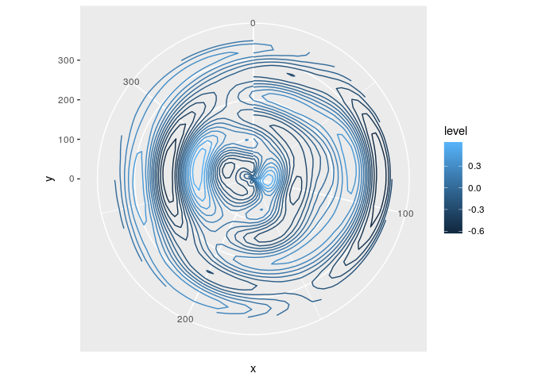
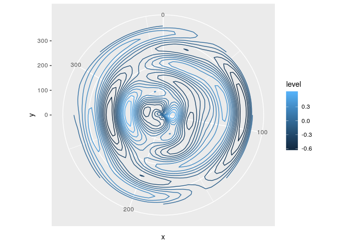

<!-- README.md is generated from README.Rmd. Please edit that file -->

# ggperiodic 

[](https://travis-ci.org/eliocamp/ggperiodic)
[](https://codecov.io/github/eliocamp/ggperiodic?branch=master)
[](https://cran.r-project.org/package=ggperiodic)

ggperiodic is an attempt to solve the issue of plotting periodic data in
ggplot2. It automatically augments your data to wrap it around to any
arbitrary domain.

## Installation

You can install the development version from
[GitHub](https://github.com/) with:

``` r
# install.packages("devtools")
devtools::install_github("eliocamp/ggperiodic")
```

## Example

Let’s create some artificial data with periodic domain

``` r
x <- seq(0, 360 - 10, by = 10)*pi/180
y <- seq(-90, 90, by = 10)*pi/180

Z <- expand.grid(x = x, y = y)
Z$z <- with(Z, 1.2*sin(x)*0.4*sin(y*2) - 
               0.5*cos(2*x)*0.5*sin(3*y) + 
               0.2*sin(4*x)*0.45*cos(2*x))

Z$x <- Z$x*180/pi
Z$y <- Z$y*180/pi
```

If you try to plot it, you’ll notice problems at the limits

``` r
library(ggplot2)
ggplot(Z, aes(x, y, z = z, color = ..level..)) +
  geom_contour() +
  coord_polar()
```



With ggperiodic you can define the periodic dimensions and ggplot2 does
the rest.

``` r
library(ggperiodic)
#> 
#> Attaching package: 'ggperiodic'
#> The following object is masked from 'package:stats':
#> 
#>     filter
Z <- periodic(Z, x = c(0, 360))

ggplot(Z, aes(x, y, color = ..level..)) +
  geom_contour(aes(z = z)) +
  coord_polar()
```


